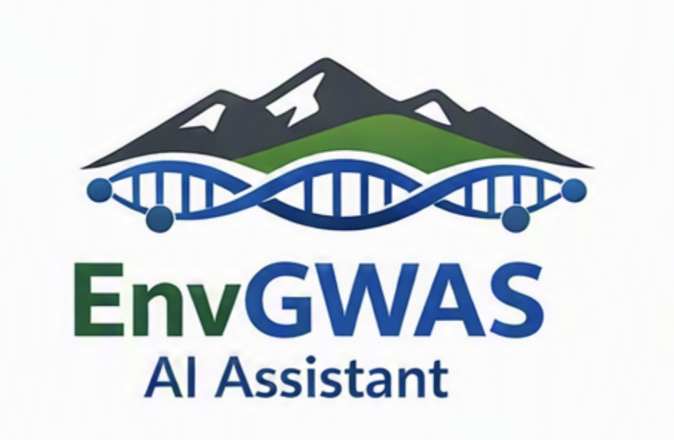

# EnvGWAS AI Assistant

<p align="center">
  
</p>


A local Retrieval-Augmented Generation (RAG) assistant for Environmental Genome-Wide Association Studies (envGWAS), built with R Shiny, Ollama, Llama 3, and Nomic Embed Text.

The application enables researchers to query their own envGWAS datasets, laboratory notes, reports, and scientific literature through a conversational interface.

Unlike cloud-based AI services, EnvGWAS AI Assistant runs entirely on local infrastructure, helping researchers maintain control of sensitive research data while leveraging modern large language models.

---

## Features

- Local deployment using Ollama
- R Shiny web interface
- Semantic document retrieval using embeddings
- Retrieval-Augmented Generation (RAG)
- Domain-specific envGWAS question answering
- General-purpose chat mode
- No external API costs
- Fully customizable knowledge base
- Open-source and researcher-friendly architecture

---

## System Architecture

```text
Knowledge Base
(txt files, reports, articles, notes)
            │
            ▼
Nomic Embedding Model
(nomic-embed-text)
            │
            ▼
Vector Embeddings
            │
            ▼
Cosine Similarity Search
            │
            ▼
Top-k Relevant Documents
            │
            ▼
Prompt Construction
            │
            ▼
Llama 3 via Ollama
            │
            ▼
Response Generation
            │
            ▼
R Shiny Interface
```

---

## How It Works

1. Documents are stored in a local knowledge base folder.
2. Each document is converted into embeddings using the `nomic-embed-text` model served by Ollama.
3. User questions are embedded using the same embedding model.
4. Cosine similarity is used to identify the most relevant documents.
5. Retrieved context is injected into a domain-specific prompt.
6. Llama 3 generates a context-aware response.
7. Responses are displayed through an interactive R Shiny interface.

---

## Use Cases

- Environmental GWAS interpretation
- Candidate gene discovery
- Literature exploration
- Knowledge management
- Research note retrieval
- Student training and onboarding
- Hypothesis generation and exploratory analysis

---

## Example Query

```text
Which genomic regions are associated with drought adaptation in the cowpea panel?
```

The assistant retrieves relevant documents from the local knowledge base and generates a context-aware answer grounded in available envGWAS resources.

---

## Technology Stack

| Component | Technology |
|------------|------------|
| User Interface | R Shiny |
| LLM | Llama 3 |
| Embeddings | Nomic Embed Text |
| Model Serving | Ollama |
| Retrieval Method | Cosine Similarity |
| Programming Language | R |

---

## Installation

### Prerequisites

- R (≥ 4.3 recommended)
- Ollama
- Llama 3 model
- Nomic Embed Text model

Install the required Ollama models:

```bash
ollama pull llama3
ollama pull nomic-embed-text
```

---

### Install Required R Packages

```r
install.packages(c(
  "shiny",
  "httr2",
  "jsonlite",
  "purrr",
  "dplyr",
  "stringr",
  "readr",
  "tibble"
))
```

---

### Prepare Knowledge Base

Create a folder containing your envGWAS resources:

```text
envgwas_kb/
├── article1.txt
├── article2.txt
├── lab_notes.txt
├── candidate_genes.txt
└── project_summary.txt
```

Supported content may include:

- Research articles
- Laboratory notes
- Project reports
- Candidate gene summaries
- Experimental protocols
- Literature reviews

---

### Run the Application

Start the Ollama server:

```bash
ollama serve
```

Launch the Shiny application:

```r
shiny::runApp("app.R")
```

The application will be available in your browser.

---

## Application Modes

### General Chat

Uses Llama 3 as a standard conversational assistant without retrieval.

### Cowpea envGWAS Assistant

Uses Retrieval-Augmented Generation (RAG):

- Retrieves relevant documents from the knowledge base
- Builds a domain-specific prompt
- Generates context-aware scientific responses

---

## Example Workflow

```text
User Question
      │
      ▼
Generate Query Embedding
      │
      ▼
Semantic Search
      │
      ▼
Retrieve Top Documents
      │
      ▼
Build envGWAS Prompt
      │
      ▼
Llama 3 Response
      │
      ▼
Display in Shiny Interface
```

---

## Repository Structure

```text
EnvGWAS-AI-Assistant/
│
├── app.R
├── README.md
├── LICENSE
├── CITATION.cff
│
├── data/
│   └── envgwas_kb/
│
├── docs/
│   ├── architecture.png
│   └── screenshots/
│
├── examples/
│   └── sample_queries.md
│
└── paper/
    └── manuscript.md
```

---

## Current Limitations

- Embeddings are generated at application startup.
- Large document collections may increase loading time.
- Retrieval uses in-memory cosine similarity rather than a dedicated vector database.
- Responses depend on the quality and coverage of the knowledge base.
- Retrieved context is limited to the top-ranked documents.

---

## Future Development

- Support for PDF ingestion
- ChromaDB or FAISS integration
- Citation-aware responses
- Multi-document summarization
- Knowledge base management dashboard
- Genomics database integration
- Multi-species envGWAS support

---

## Citation

If you use EnvGWAS AI Assistant in your research, please cite the associated software paper (forthcoming).

---

## License

License information will be added upon release.

---

## Author

Developed by researchers interested in applying open-source large language models and Retrieval-Augmented Generation (RAG) to environmental genomics and genome-wide association studies.

---

## Project Status

Active development.

**Version:** v0.1.0

**Release Type:** Research Prototype
